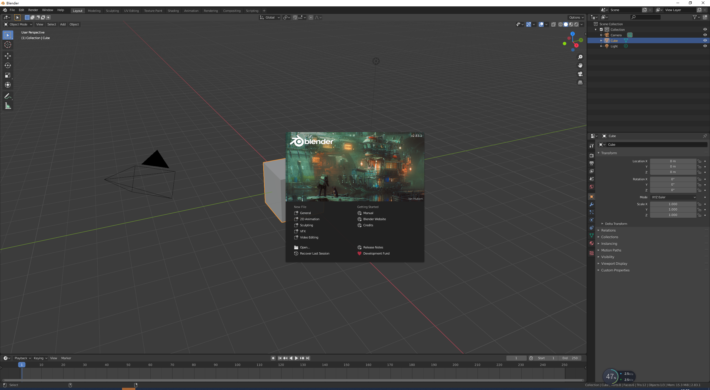
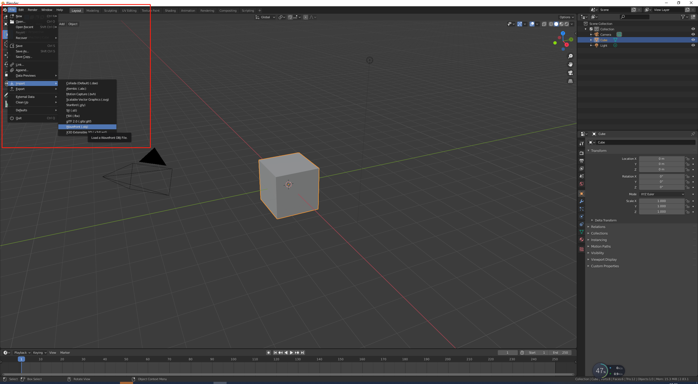
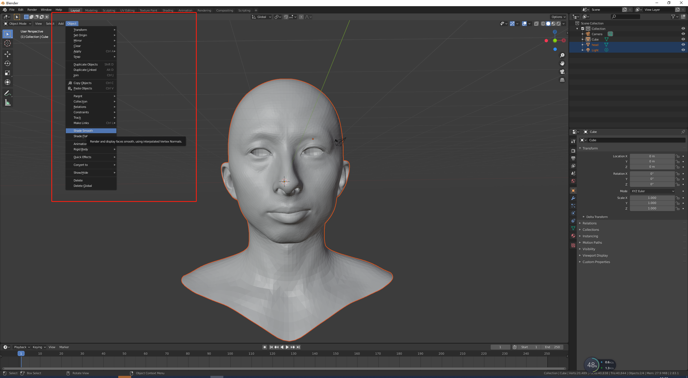
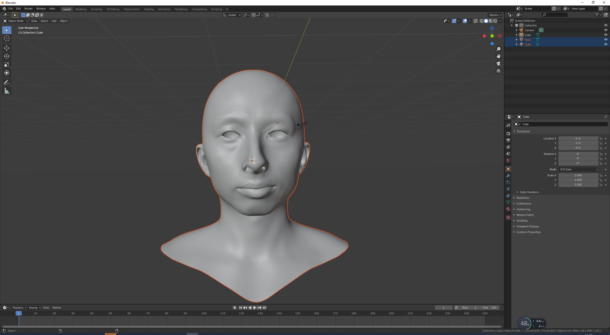
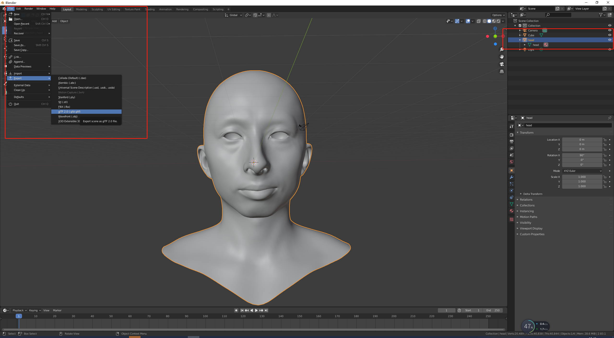
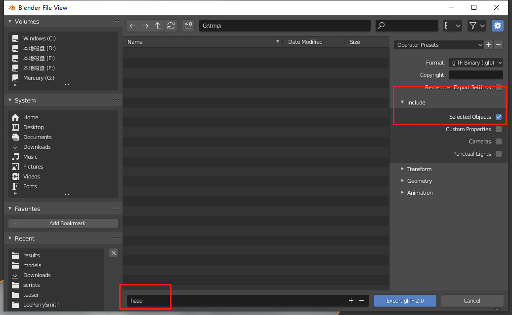
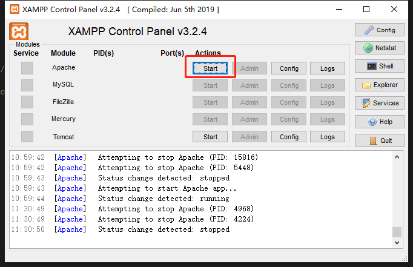
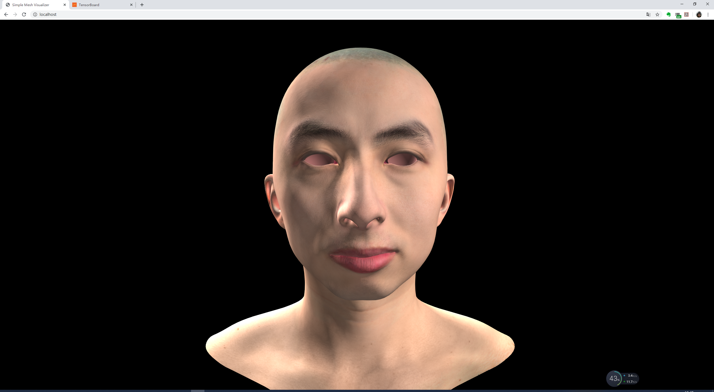

# Simple Mesh Visualizer

This is a simple mesh visualizer developed in **[three.js](https://threejs.org/)**. The codes are modified from this **[example](https://github.com/mrdoob/three.js/blob/dev/examples/webgl_decals.html)**.

You can use it for rendering **3d mesh** file with **diffuse** and **normal** maps.

The files in **./models** are generated using **[High-Fidelity 3D Digital Human Creation from RGB-D Selfies](https://github.com/tencent-ailab/hifi3dface)**.

## Usage

1. Data preparation.

   Convert **.obj** file into **.glb/.gltf** file (You can use **[blender](https://www.blender.org/)** to do the conversion)

   Below is a simple tutorial in blender 2.83.

   - open blender
     <p></p>

   - import .obj file
     <p></p>

   - smooth vertex normal

     **before**
     <p></p>

     **after**: notice that the faces are smoothed.
     <p></p>

   - export .glb file

     make sure only the head.obj file is selected.
     <p></p>
     <p></p>


2. Data placement.
   
   Put all files into **./models**, including a **.glb** file, a **diffuse** map, a **normal** map and a **specular** map.

3. Code editing.
   
   Open **index.html** in text/code editor and change the corresponding filenames below.

   ```javascript
   function loadMesh() {
   
   	  var loader = new GLTFLoader();
   
   	  loader.load( 'models/head.glb', function ( gltf ) { // 3d mesh
   
   	  	mesh = gltf.scene.children[ 0 ];
   	  	var diffuse = textureLoader.load( 'models/diffuse.png' ); // diffuse map
   	  	diffuse.flipY = false;
   	  	var specular = textureLoader.load( 'models/specular.TGA' ); // specular map
   	  	specular.flipY = false;
   	  	var normal = textureLoader.load( 'models/normal.png' ); // normal map
   	  	normal.flipY = false;
   	  	normal.encoding = THREE.sRGBEncoding;
             var normalScale = new THREE.Vector2( 0.5, 0.5);
   	  	mesh.material = new THREE.MeshPhongMaterial( {
   	  		specular: 0x111111,
   	  		map: diffuse,
   	  		specularMap: specular,
   	  		normalMap: normal,
   	  		shininess: 20,
   	  		normalScale: normalScale,
   	  	} );
   
   	  	scene.add( mesh );
   	  	mesh.scale.set( 3, 3, 3 );
   
   	  } );
   
   }
   ```

4. Serving.
   
   Load the webpage in **apache** or any other server software. I recommend using **[xampp](https://www.apachefriends.org/index.html)** in windows, and **[mampp](https://www.mamp.info/en/mamp/mac/)** in macos, because they are simple to use.

   Below is the tutorial for using **xampp** in windows 10.

   - Open **/path/to/xampp/apache/conf/httpd.conf**
   - Search for **DocumentRoot** and set values to the path to this visualizer
   ```
   DocumentRoot "/path/to/this/visualizer"
   <Directory> "/path/to/this/visualizer"
   ```
   - Press "start" button in the control pannel
     <p></p>
   
   - Open the visualizer in [localhost](http://127.0.0.1)

   - Clear browser cache and refresh if necessary.


## Results

   <p></p>

## Contact

   If you have any question regarding this repo, please contact **jadechancyj907@gmail.com**.